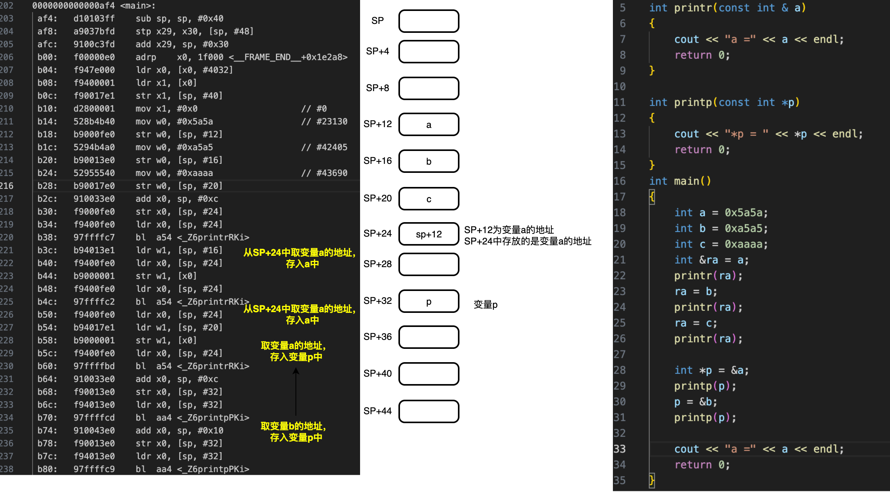
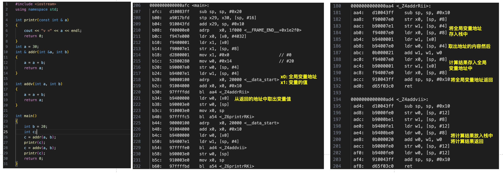

## 第八章 函数探幽
### 8.1 c++内联函数

内联函数 与 宏定义

- 相同：两者都是在调用点展开。
- 不同：
  - 宏定义需要仔细考虑括号，否则可能产生意想不到的结果。
  - 内联函数也是函数，同样需要遵循变量的检查。比宏定义要有优势。

### 引用变量
引用只是变量的别名。
  - 指针与饮用的区别
  - 指针是一种数据类型，有单独的存储空间。
  - 引用不是任何一种数据类型，只是变量的别名。
  - 指针可以在任意时刻都重新赋值，可以更改指向的地址。
  - 变量在初始化时必须指定饮用的变量，且不可更改。

例如上图：

定义一个变量a，引用ra，从栈上开辟一片空间用于存放变量a的地址，这个栈上的空间sp+24即表示引用ra。
后续所有对ra的使用都是栈上读取sp+24的内容及变量a的地址，再将内容写入到a的地址中。

### 引用与函数

- 入参是引用
- 函数返回类型是引用

